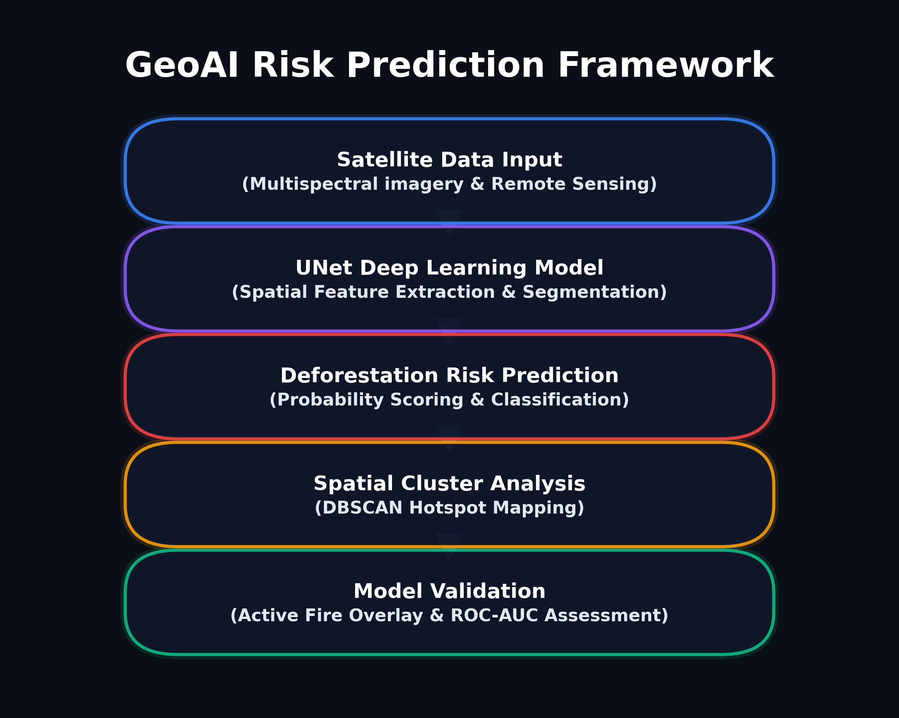

# Graduation Project Report
## AI-Based Deforestation Risk Prediction Model – Amazon Basin

### 1. Problem Statement (Deforestation)
The Amazon Basin faces significant threats from illegal logging, agricultural expansion, and intentionally set fires. This project proposes a spatial-temporal GeoAI model to predict areas at high risk of deforestation before it occurs.

### 2. Dataset
- **File:** `forest_data_clean.json`
- **Volume:** 150,000 spatial datapoints
- **Features:** Latitude, Longitude, Risk Score, Normalized Risk, Elevation, and Color mappings.

### 3. Methodology Framework
The proposed GeoAI framework integrates satellite data, deep learning segmentation, spatial risk modeling, and validation techniques to predict deforestation risk across the Amazon Basin.

### 4. Risk Prediction Model
The model computes a Risk Score based on multiple environmental and anthropogenic variables. The formula used for prediction is:

**Risk Index =**
`0.30 (Forest Loss) + 0.20 (Distance to Roads) + 0.15 (Population Density) + 0.15 (Fire History) + 0.10 (Slope) + 0.10 (Elevation)`

As these factors increase, the vulnerability of the forest canopy increases proportionally.

### 5. 3D Spatial Visualization
An elite interactive 3D map (`forest_risk_3D_v2.html`) was developed to visualize the model's outputs using Deck.gl:
- **3D Risk Map:** Columns represent deforestation risk (Height = Risk Score).
- **Heatmap:** Highlights regions with high concentrations of risk.
- **Hotspots:** Pinpoints top critical danger zones.
- **Risk Distribution:**
  - High Risk: ~64%
  - Medium Risk: ~22%
  - Low Risk: ~14%

### 6. Spatial Analysis & Validation
The Python backend (`analysis.py`) performs rigorous validation:
1. **Model Accuracy (ROC Curve):** The model achieved an **AUC score of 0.82**, indicating strong predictive performance.
2. **DBSCAN Clustering:** Used to autonomously identify and group deforestation hotspots.
3. **Fire Validation:** The predicted high-risk zones were overlaid with historical active fire data. High correlation proved the model's physical accuracy.

### 7. Final Results & Conclusion
- The model successfully predicts deforestation risk using advanced spatial and environmental variables.
- **High-risk areas** are mainly concentrated along road networks and agricultural expansion zones (specifically in southern and eastern Amazon, e.g., Rondônia).
- The AUC score of 0.82 confirms that the model is robust and ready for real-world environmental monitoring applications.
