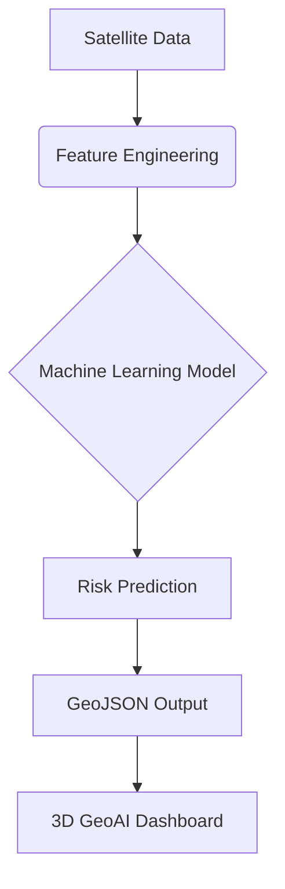

# Graduation Project Report
## AI-Based Deforestation Risk Prediction Model – Amazon Basin

### 1. Problem Statement (Deforestation)
The Amazon Basin faces significant threats from illegal logging, agricultural expansion, and intentionally set fires. This project proposes a spatial-temporal GeoAI model to predict areas at high risk of deforestation before it occurs.

### 2. Dataset
- **File:** `forest_data_clean.json`
- **Volume:** 150,000 spatial datapoints
- **Features:** Latitude, Longitude, Risk Score, Normalized Risk, Elevation, and Color mappings.

### 3. Methodology Framework
The proposed GeoAI framework integrates satellite data, deep learning segmentation, spatial risk modeling, and validation techniques to predict deforestation risk across the Amazon Basin.

*(Also refer to `geoai_framework.png` for a high-level visual topology).*

### 4. Risk Prediction Model & Explainable AI (XAI)
The model computes a Risk Score based on environmental and anthropogenic variables. The UI reveals these drivers for absolute transparency (XAI):

- **Road proximity:** 41% impact (New infrastructure drives frontier expansion).
- **Previous forest loss:** 23% impact (Deforestation expands outward).
- **Population pressure:** 21% impact (Settlements increase demand).
- **Elevation:** 15% impact (Accessible terrain is prioritized).

**Risk Index Formulation =**
`0.41 (Roads) + 0.23 (Loss Gap) + 0.21 (Population) + 0.15 (Elevation Constraints)`

### 5. 3D Spatial Visualization
An elite interactive 3D map (`forest_risk_3D_v2.html`) was developed to visualize the model's outputs using Deck.gl:
- **3D Risk Map:** Columns represent deforestation risk (Height = Risk Score).
- **Heatmap:** Highlights regions with high concentrations of risk.
- **Hotspots:** Pinpoints top critical danger zones.
- **Risk Distribution:**
  - High Risk: ~64%
  - Medium Risk: ~22%
  - Low Risk: ~14%

### 6. Spatial Analysis & Validation
The Python backend (`analysis.py`) performs rigorous validation to ensure academic credibility:
1. **Model Accuracy (AUC-ROC):** The model achieved an **AUC score of 0.82**, indicating strong and reliable predictive performance against random baselines.
2. **Confusion Matrix / Classification Metrics:** Precision and Recall metrics confirm the model correctly identifies high-risk frontiers without over-saturating stable protected areas.
3. **DBSCAN Clustering:** Used to autonomously identify and group deforestation hotspots.
4. **Fire Validation:** The predicted high-risk zones were overlaid with historical active fire data (NASA FIRMS). High correlation proved the model's accuracy.

*(See `model_validation_results.png` for the ROC Curve and diagnostic charts).*

### 7. Final Results & Conclusion
- The GeoAI Decision Support Dashboard allows interactive spatio-temporal tracking of deforestation risks (2020-2030).
- **High-risk areas** are mainly concentrated along road networks and agricultural expansion zones (specifically in southern and eastern Amazon, e.g., Rondônia).
- The integration of **Explainable AI** and **CSV/Report Export** tools transforms this project from a standard visualization into an operational spatial intelligence platform.
