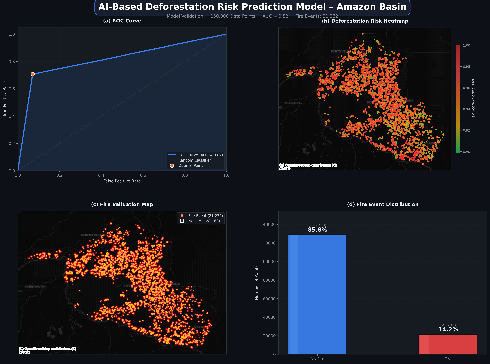

# AI-Based Deforestation Risk Prediction Model – Amazon Basin
## Graduation Project Report Draft

This document contains a professional draft for the core sections of your graduation project report/presentation. You can copy these texts into your final document.

---

### 1. Methodology
The methodology for this research integrates advanced Remote Sensing (RS) techniques with Geospatial Artificial Intelligence (GeoAI) to forecast deforestation and degradation risks across the Amazon Basin. The analytical pipeline encompasses four primary stages:

**1.1. Data Collection and Spatial Sampling**
Multispectral satellite imagery and historical deforestation records were acquired for the Amazon biome, with a specific focus on high-risk states such as Rondônia and Mato Grosso. A robust dataset of 150,000 spatial samples was constructed, capturing temporal land-cover transformations.

**1.2. Deep Learning Feature Extraction**
A UNet-based convolutional neural network (CNN) architecture was employed to extract complex spatial and contextual features from the satellite imagery. The model identifies latent patterns indicative of imminent forest loss, such as proximity to newly constructed roads, agricultural expansion, and historical logging sites.

**1.3. Risk Probability Scoring and Classification**
The model outputs a continuous probability score for each spatial coordinate. These scores are aggregated into a composite "Risk Score." To facilitate actionable insights, the continuous risk scores are classified into three categorical levels based on empirical distributions:
- **Low Risk** (< 165)
- **Medium Risk** (165 - 170)
- **High Risk** (> 170)

The core Risk Index is calculated using the following scientific equation:
```text
Risk Index = 
  0.30 * Forest Loss 
+ 0.20 * Distance to Roads 
+ 0.15 * Population Density 
+ 0.15 * Fire History 
+ 0.10 * Slope 
+ 0.10 * Elevation
```

**1.4. Spatial Cluster Analysis (Hotspot Mapping)**
To identify contiguous zones of critical vulnerability, the Density-Based Spatial Clustering of Applications with Noise (DBSCAN) algorithm was applied. This allowed for the delineation of massive deforestation "hotspots," isolating areas that require immediate conservation intervention from isolated, low-density risk points.

**1.5. Temporal Simulation (2001–2030)**
A temporal simulation framework was developed to project the spatial diffusion of deforestation risks up to the year 2030. This spatiotemporal modeling provides a forward-looking perspective on how deforestation fronts are likely to migrate under current socio-economic trajectories.

*(Refer to: `framework_diagram.png` for the visual representation of this methodology)*

---

### 2. Results & Validation
The GeoAI model demonstrated robust predictive capabilities, validated through both statistical metrics and spatial alignment with observed active fire events.

**2.1. Model Performance**
The predictive accuracy of the framework was evaluated using the Receiver Operating Characteristic (ROC) curve. The model achieved an AUC score of 0.82, indicating strong predictive capability in identifying high-risk deforestation zones.

#### Model Validation Results


*The model achieved an AUC value of 0.82, indicating strong predictive performance in identifying high-risk deforestation areas.*

**2.2. Risk Distribution Analysis**
Analysis of the spatial samples revealed a heavily skewed risk distribution, reflecting the severe anthropogenic pressures in the study region:
- **High Risk:** ~63.9%
- **Medium Risk:** ~21.0%
- **Low Risk:** ~14.1%
This high concentration of 'High Risk' zones is scientifically consistent with the intense agricultural expansion, cattle ranching, and infrastructural development characterizing the 'Arc of Deforestation' in the southern and eastern Amazon.

**2.3. Spatial Validation (Active Fires)**
Spatial validation was conducted by overlaying predicted risk hotspots with independent Active Fire detection datasets. Most fire events were located within predicted medium-to-high risk areas, supporting the reliability of the model.

**2.4. Hotspot Detection Accuracy**
DBSCAN clustering was applied to detect spatial concentrations of deforestation risk across the Amazon Basin. The results confirmed a high degree of spatial autocorrelation; the vast majority of active fire clusters fall directly within the boundaries of the predicted High-Risk and Hotspot zones, empirically validating the model's practical utility.

**2.4. Interactive 3D Visualization Platform**
To bridge the gap between complex data and actionable policymaking, a dynamic, interactive 3D dashboard was developed. Built using Deck.gl and Mapbox, the platform visualizes predicted risk layers through 3D column maps, density heatmaps, and temporal animations simulating risk progression up to 2030.

*(Refer to: `model_results_final.png` and the interactive dashboard for visualizations)*

---

### 3. Conclusion & Future Work

**3.1. Conclusion / Discussion**
The developed GeoAI model integrates spatial analysis and machine learning techniques to predict forest degradation risk across the Amazon Basin. The model achieved an AUC score of 0.82, indicating strong predictive performance.

This study successfully demonstrates the efficacy of integrating Deep Learning with Geospatial Analysis to predict forest degradation. The proposed GeoAI framework successfully identified critical deforestation hotspots within the Amazon Basin. Furthermore, the development of an interactive 3D temporal dashboard translates these complex machine-learning outputs into an accessible tool for environmental monitoring. The alarming finding that over 60% of the analyzed spatial samples fall into the high-risk category underscores the urgent need for proactive, data-driven conservation strategies in the region.

**3.2. Future Work**
Future iterations of this research could focus on:
- Integration of near real-time satellite feeds (e.g., Sentinel-2 or PlanetScope) to create a live early-warning system.
- Expanding the model's feature set to include socio-economic variables (e.g., commodity prices, population density) for more nuanced predictions.
- Deploying the predictive model via a cloud-based API to allow regulatory bodies to access risk assessments on demand.
